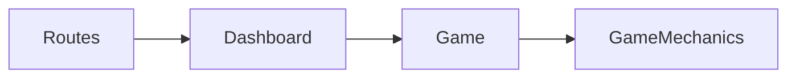

# 98point6 Drop Token

Take home assignment for 98point6.
Written in Python 3 using Flask.

## Running the Project

- Location: in a terminal inside the root of the directory
- Create the environment:
  - `py -m venv env`
- Activate the environment:
  - `env/Scripts/activate`
- Install dependencies:
  - `pip install -r requirements.txt`

---

